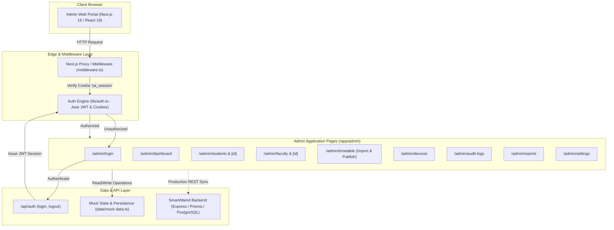
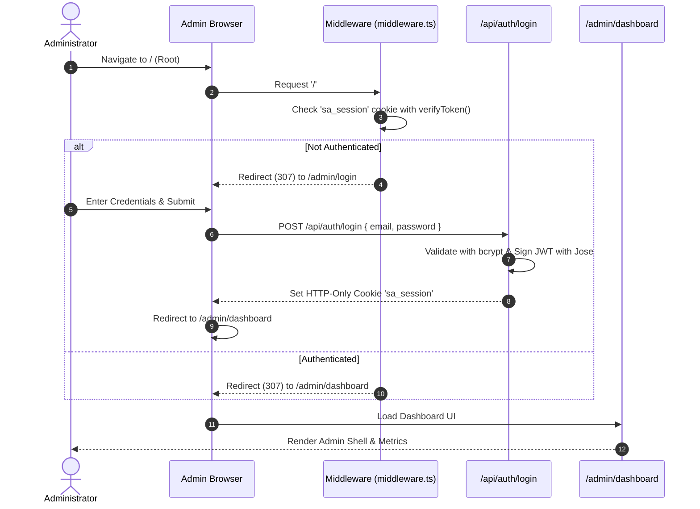
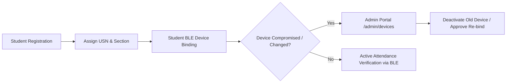

# SmartAttend Admin Web Portal

SmartAttend Admin Web is the institutional administration portal for the SmartAttend Smart Attendance System. It provides university administrators with a clean, responsive, and secure console to manage student accounts, faculty profiles, academic structures, timetables, device authorizations, audit logs, and real-time attendance analytics.

---

## 📑 Table of Contents
- [Architecture & Flowcharts](#-architecture--flowcharts)
- [Directory Structure & Code File Overview](#-directory-structure--code-file-overview)
- [Features & Capabilities](#-features--capabilities)
- [Tech Stack](#-tech-stack)
- [Local Setup & Installation](#-local-setup--installation)
- [Authentication & Security Flow](#-authentication--security-flow)

---

## 📐 Architecture & Flowcharts

### 1. High-Level System Architecture



---

### 2. Authentication & Authorization Flow



---

### 3. Student & Device Binding Lifecycle



---

## 📂 Directory Structure & Code File Overview

```
Website_SmartAttend/
├── app/                                # Next.js 16 App Router Directory
│   ├── admin/                          # Administrative routes & views
│   │   ├── [...slug]/page.tsx          # Catch-all fallback routing
│   │   ├── academic-master/page.tsx    # Academic Master (Dept, Subject, Section)
│   │   ├── attendance/page.tsx         # Attendance monitoring & logs
│   │   ├── audit-logs/page.tsx         # System audit logs & events
│   │   ├── bulk-update/page.tsx        # Batch student promotions/updates
│   │   ├── dashboard/page.tsx          # Admin overview & system metrics
│   │   ├── devices/page.tsx            # BLE & Hardware device authorizations
│   │   ├── faculty/                    # Faculty management & [id] profile
│   │   ├── login/page.tsx              # Secure Admin login portal
│   │   ├── reports/page.tsx            # Attendance analytics & export center
│   │   ├── settings/page.tsx           # Global institution settings (8 categories)
│   │   ├── students/                   # Student directory, create & [id] details
│   │   ├── timetable/                  # Timetable management, import & publish
│   │   └── users/page.tsx              # Admin user accounts & RBAC management
│   ├── api/
│   │   └── auth/                       # API route handlers for login & logout
│   ├── globals.css                     # Global styles, variables & Tailwind CSS
│   ├── layout.tsx                      # Root layout wrapper
│   └── page.tsx                        # Root entry point with redirect logic
├── components/                         # Modular & Reusable UI Components
│   ├── admin-shell.tsx                 # Responsive side navigation & header shell
│   ├── smartattend-admin-pages.tsx     # Admin sub-screens (Audit, Users, Devices)
│   ├── smartattend-feature-pages.tsx   # Feature screens (Timetable, Import, Publish)
│   ├── smartattend-pages.tsx           # Primary views (Dashboard, Students, Faculty)
│   └── ui/                             # Base UI components (Buttons, Inputs, Cards)
├── data/
│   └── mock-data.ts                    # Structured dataset for mock operations
├── lib/
│   ├── auth.ts                         # JWT creation, verification, password hashing
│   ├── db.ts                           # Database helpers
│   ├── rate-limit.ts                   # In-memory request rate limiting
│   └── utils.ts                        # Tailwind class utilities (clsx & twMerge)
├── middleware.ts                       # Edge authentication & route protection
├── next.config.mjs                     # Next.js build & runtime configuration
├── tsconfig.json                       # TypeScript compiler configuration
└── package.json                        # Dependencies & project scripts
```

---

## ✨ Features & Capabilities

1. **Dashboard & System Health:** Live institutional metrics, quick actions, attendance percentages, and alerts.
2. **Student Lifecycle Management:** Manual and bulk CSV/Excel student ingestion, USN tracking, and profile modification.
3. **Faculty Management:** Departmental faculty indexing, subject allocation, and contact management.
4. **Device Authorization & Strict Binding:** Monitor registered student hardware and BLE identifiers to prevent proxy attendance.
5. **Timetable Workflow:** Excel/CSV timetable schedule import, draft preview, conflict validation, and one-click publishing.
6. **Bulk Academic Operations:** Batch promote students across semesters and sections with full audit tracking.
7. **System Audit Trail:** Real-time log of administrative events with timestamps, user IDs, and action descriptions.
8. **Role-Based Access Control (RBAC):** Super Admin, Admin, and Viewer access tiers.

---

## 🛠 Tech Stack

- **Framework:** [Next.js 16 (App Router)](https://nextjs.org/)
- **UI & State:** [React 19](https://react.dev/)
- **Styling:** [Tailwind CSS v4](https://tailwindcss.com/)
- **Icons:** [Lucide React](https://lucide.dev/)
- **Auth & Cryptography:** [Jose](https://github.com/panva/jose) (JWT) & [Bcryptjs](https://github.com/dcodeIO/bcrypt.js)
- **Language:** [TypeScript 5](https://www.typescriptlang.org/)

---

## 🚀 Local Setup & Installation

### Prerequisites
- Node.js `v18.0.0` or higher
- npm `v9.0.0` or higher

### 1. Clone the repository
```bash
git clone https://github.com/TheSoftwareSociety/Smart-Attend-admin.git
cd Smart-Attend-admin
```

### 2. Install dependencies
```bash
npm install
```

### 3. Configure Environment Variables
Create a `.env.local` file in the root directory:
```env
AUTH_SECRET=your-random-32-character-secret-key-here
NEXT_PUBLIC_APP_URL=http://localhost:3000
NODE_ENV=development
```

### 4. Run Development Server
```bash
npm run dev
```
Navigate to `http://localhost:3000` in your web browser.

### 5. Build for Production
```bash
npm run build
npm run start
```

---

## 🔒 Default Admin Credentials (Demo)

| Email | Password | Role |
|---|---|---|
| `admin@smartattend.edu` | `admin123` | Super Admin |

---

## 🌐 Repository

- **GitHub:** [https://github.com/TheSoftwareSociety/Smart-Attend-admin.git](https://github.com/TheSoftwareSociety/Smart-Attend-admin.git)
